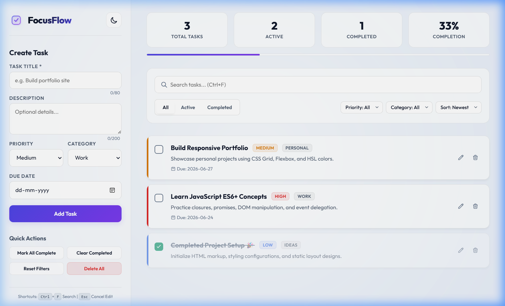
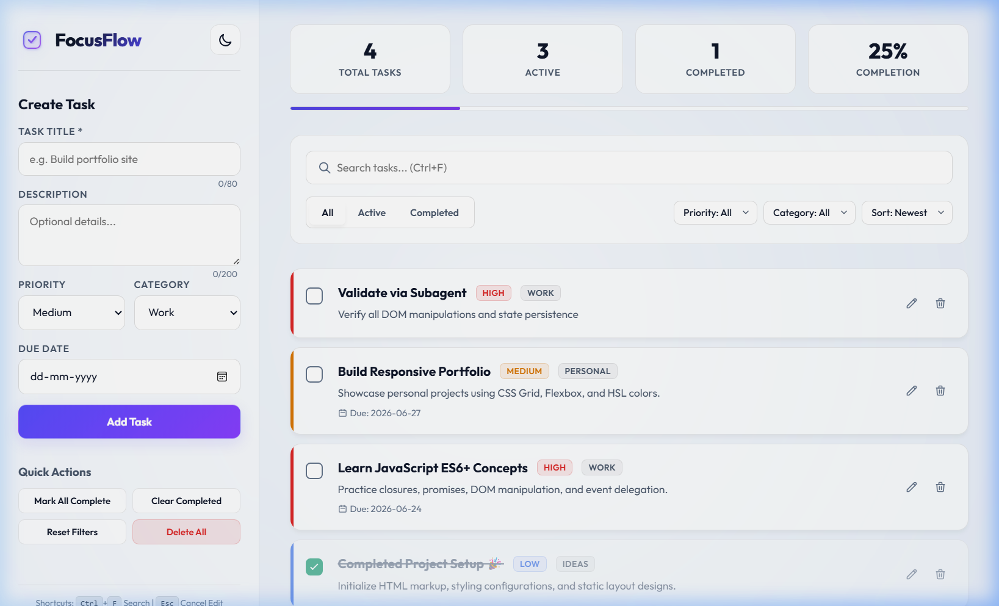
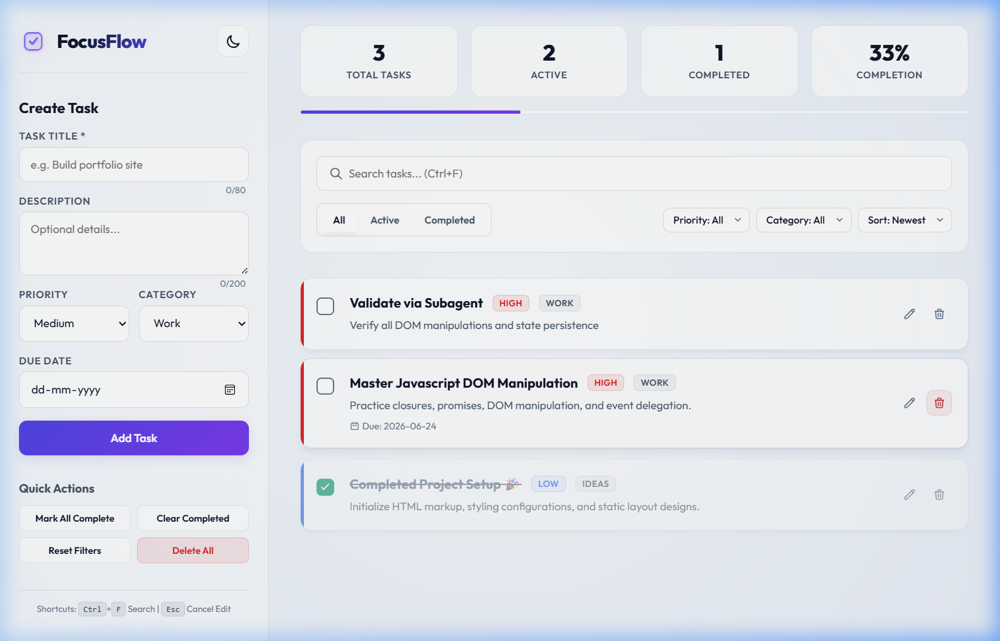

# FocusFlow — Premium State-Driven Task Manager

FocusFlow is an interactive, client-side To-Do List and productivity board built entirely with **Vanilla HTML5, CSS3, and Modern JavaScript (ES6+)**. The project is designed with a premium glassmorphism dark aesthetic (with built-in light mode toggle) and demonstrates advanced DOM manipulation, centralized state management, event delegation, and browser data persistence.

## Features

- **Full CRUD Operations**:
  - **Create**: Add tasks with title, description, custom category, priority (High, Medium, Low), and optional due date.
  - **Read**: Live rendering, layout states, and adaptive design tags.
  - **Update**: Check off tasks, toggle priority, and perform inline task card editing (double-click card to edit).
  - **Delete**: Soft delete with fluid sliding and fade-out animations.
- **State-First Architecture**: Single source of truth driving the entire layout. User actions change the state object; the DOM redraws automatically in response.
- **Browser LocalStorage Persistence**: Saves list items and user theme preferences seamlessly across sessions.
- **Advanced Filters & Search**:
  - Status tabs: All, Active, and Completed.
  - Filter by category and priority level.
  - Real-time search by task titles and descriptions.
  - Custom sorting: Newest, Oldest, Alphabetical, and Priority.
- **Interactive Metrics Dashboard**: Live progress bar showing percentage of completed tasks and total metrics count.
- **Toast Alerts & Shakes**: Clean, non-blocking toast notifications for CRUD feedback, along with shake animations for form validation errors.
- **Interactive Modals**: Non-blocking custom CSS/JS confirmation modals for destructive batch actions (like Delete All and Clear Completed).
- **Responsive Layout**: Designed with CSS Grid and Flexbox to deliver a beautiful experience across Mobile, Tablet, and Desktop.

## Keyboard Shortcuts

| Shortcut | Action |
| -------- | ------ |
| `Ctrl` + `F` | Focus search field |
| `Ctrl` + `Shift` + `D` | Toggle theme (Dark / Light) |
| `Ctrl` + `Enter` | Save edits (when editing task inline) |
| `Escape` | Cancel inline edit |
| `Delete` | Delete currently focused task card |

## Folder Structure

```text
JavaScript Logic & State Management/
│
├── index.html
├── styles.css
├── app.js
│
├── assets/
│   ├── logo.svg
│   ├── empty-state.svg
│   └── screenshots/
│       ├── landing_state.png
│       ├── task_created.png
│       └── persisted_state.png
│
└── README.md
```

## Preview & Screenshots

### Application Dashboard 


### Task Creation & Context Metric Updates


### Persistent Local Storage Recovery


## Running the Application

Since this is a client-side vanilla web app, there are no builds, dependencies, or configuration setups required.
1. Open the directory containing this project in your terminal or files explorer.
2. Open `index.html` directly in any modern browser (Chrome, Edge, Firefox, Safari) or run a local development server like Live Server.

